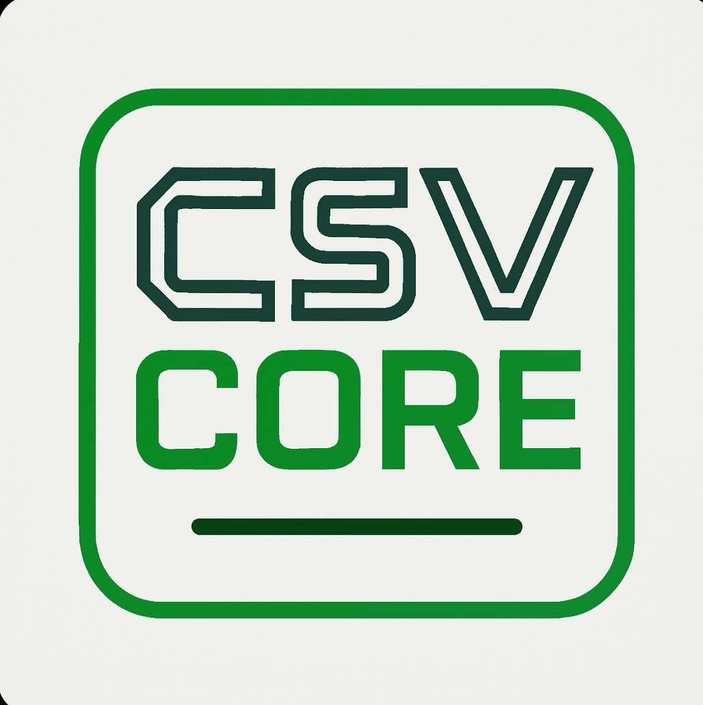

<h1 align="center">
  <br>
  
  <br>
</h1>

<h4 align="center">The only package you'll need to handle CSV files</h4>

<div align="center">

[](https://github.com/DotNet2Web/csvcore/actions?query=branch%3amain)
[](https://coveralls.io/github/DotNet2Web/CsvCore?branch=main)
[](https://github.com/DotNet2Web/csvcore/releases/latest)
[](https://www.nuget.org/packages/csvcore)
[](https://libraries.io/nuget/csvcore)

[](https://github.com/DotNet2Web/csvcore/graphs/contributors)
[](https://github.com/DotNet2Web/csvcore)
[](https://github.com/DotNet2Web/csvcore/graphs/commit-activity)
[](https://github.com/DotNet2Web/csvcore/issues)
[](https://makeapullrequest.com)


<a href="#about">About</a> •
<a href="#how-to-use-it">How To Use</a> •
<a href="#download">Download</a> •
<a href="#contributors">Contributors</a> •
<a href="#versioning">Versioning</a> •
<a href="#credits">Credits</a> •
<a href="#related">Related</a> •
<a href="#license">License</a>

</div>

## About

### What's this?

The CsvCore library is a .NET library that provides a simple and efficient way to read, write and validate CSV files.
It is designed to be easy to use, flexible, and blazing fast, making it an ideal choice for developers who need to work with CSV data in their applications.

### What's so special about that?

No hassle, no fuss, no complexity but straight out of the box a working, CsvCoreReader and CsvCoreWriter.

### Who created this?
My name is Tino Klijn, and I'm a tech lead in the .NET environment.

Since I have worked in development I encountered many libraries that support CSV handling, but none of them matched my expectations.

I strongly believe that a library should be easy to understand and to use, otherwise what is the point of creating a package for your fellow devs.

So I decided to create my own library that is simple, easy to use and flexible.

Suggestions for improvements are always welcome.
Please [contact me](tino@dotnet2web.nl) to tell me your needs in the package or simply create an issue or pull request on GitHub.

## How do I use it?

Easy, add the package to you project using the following command: `dotnet add package csvcore` or by using the NuGet package manager in your IDE.
Then register one of the services or both in your IoC container.

```csharp
builder.Services.AddScoped<ICsvCoreReader, CsvCoreReader>();
builder.Services.AddScoped<ICsvCoreWriter, CsvCoreWriter>();
```

Next read all about it in the wiki:

[Wiki](https://github.com/DotNet2Web/CsvCore/wiki)

## Download

This library is available as [a NuGet package](https://www.nuget.org/packages/csvcore) on https://nuget.org. To install it, use the following command-line:

  `dotnet add package csvcore`

## Building

To build this repository locally, you need the following:
* The [.NET SDKs](https://dotnet.microsoft.com/en-us/download/visual-studio-sdks) for .NET 8.0 and 9.0.
* Visual Studio, JetBrains Rider or Visual Studio Code with the C# DevKit

You can also build, run the unit tests and package the code using the following command-line:

`build.ps1`

Or, if you have, the [Nuke tool installed](https://nuke.build/docs/getting-started/installation/):

`nuke`

Also try using `--help` to see all the available options or `--plan` to see what the scripts does.

## Contributing

Your contributions are always welcome! Please have a look at the [contribution guidelines](CONTRIBUTING.md) first.

Previous contributors include:

<a href="https://github.com/DotNet2Web/csvcore/graphs/contributors">
  
</a>

(Made with [contrib.rocks](https://contrib.rocks))

## Versioning
This library uses [Semantic Versioning](https://semver.org/) to give meaning to the version numbers. For the versions available, see the [tags](/releases) on this repository.

## Credits
This library wouldn't have been possible without the following tools, packages and companies:

* [Nuke](https://nuke.build/) - Smart automation for DevOps teams and CI/CD pipelines by [Matthias Koch](https://github.com/matkoch)
* [xUnit](https://xunit.net/) - Community-focused unit testing tool for .NET by [Brad Wilson](https://github.com/bradwilson)
* [Coverlet](https://github.com/coverlet-coverage/coverlet) - Cross platform code coverage for .NET by [Toni Solarin-Sodara](https://github.com/tonerdo)
* [Polysharp](https://github.com/Sergio0694/PolySharp) - Generated, source-only polyfills for C# language features by [Sergio Pedri](https://github.com/Sergio0694)
* [GitVersion](https://gitversion.net/) - From git log to SemVer in no time
* [ReportGenerator](https://reportgenerator.io/) - Converts coverage reports by [Daniel Palme](https://github.com/danielpalme)
* [StyleCopyAnalyzer](https://github.com/DotNetAnalyzers/StyleCopAnalyzers) - StyleCop rules for .NET
* [Roslynator](https://github.com/dotnet/roslynator) - A set of code analysis tools for C# by [Josef Pihrt](https://github.com/josefpihrt)
* [CSharpCodingGuidelines](https://github.com/bkoelman/CSharpGuidelinesAnalyzer) - Roslyn analyzers by [Bart Koelman](https://github.com/bkoelman) to go with the [C# Coding Guidelines](https://csharpcodingguidelines.com/)
* [Meziantou](https://github.com/meziantou/Meziantou.Framework) - Another set of awesome Roslyn analyzers by [Gérald Barré](https://github.com/meziantou)
* [Verify](https://github.com/VerifyTests/Verify) - Snapshot testing by [Simon Cropp](https://github.com/SimonCropp)
* [FluentAssertions](https://fluentassertions.com/) - Assert your results in a fluent way by [Dennis Doomen](https://github.com/DennisDoomen)
* [Bogus](https://github.com/bchavez/Bogus) - Generate random data for test purposes, a must need package for your tests.

## Special thanks
* [Dennis Doomen](https://www.linkedin.com/in/dennisdoomen/) - For always willing to help me out.
* [Jeordie Penders](https://www.linkedin.com/in/jeordiependers/) - For testing the library and suggesting new features.

## Support the project

* [Tip Me](https://paypal.me/DotNet2Web?country.x=NL&locale.x=nl_NL)
* [Buy me a Coffee](https://ko-fi.com/dotnet2web)

## You may also like

* [Hiring me for you projects](https://dotnet2web.nl)

## License
This project is licensed under the MIT License - see the [LICENSE](LICENSE) file for details.
